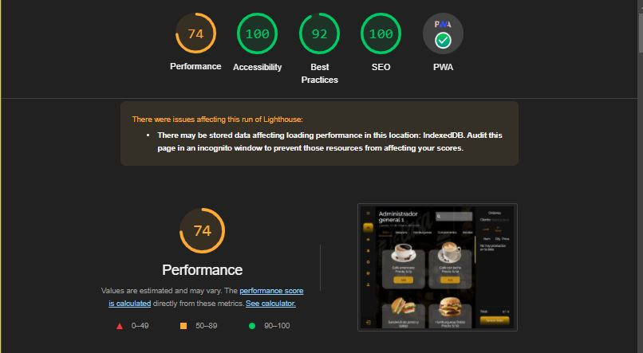

# Burger House (API Client)

## Índice

* [1. Descrpición del Proyecto](#1-preámbulo)
* [2. Orientación al Usuario](#2-resumen-del-proyecto)
* [3. Diseño de la Interfaz](#3-Diseño-de-la-Interfaz)
* [4. Test](#4-Test)
* [5. PWA](#5-PWA)
* [6. Fuentes](#6-Fuentes)
* [7. Autores](#7-Autores)

***

## 1. Descrpición del Proyecto
Burger House es una aplicación responsive diseñada para un pequeño restaurante de hamburguesas en crecimiento que necesita un sistema con el que puedan tomar pedidos y enviarlos a la cocina para que se preparen de manera ordenada y eficiente.
Cuenta con un sistema de autenticación que permite tener diferentes vistas y funciones dependiendo del rol del usuario.

Este proyecto es una aplicación web progresiva, que funciona sin conexión y que utiliza React como Librería, Style Component para los estilos, Figma para el prototipado, que se integra con una  REST API de creación propia.

## 6. Test

### Frameworks / libraries

* [React](https://reactjs.org/)

### Herramientas

* [npm-scripts](https://docs.npmjs.com/misc/scripts)
* [Babel](https://babeljs.io/)
* [webpack](https://webpack.js.org/)
* [json-server](https://www.npmjs.com/package/json-server)
* [mockoon](https://mockoon.com)
* [nock](https://github.com/nock/nock)
* [Tu primera Progressive Web App - Google developers](https://developers.google.com/web/fundamentals/codelabs/your-first-pwapp/?hl=es)
* [Progressive Web Apps - codigofacilito.com](https://codigofacilito.com/articulos/progressive-apps)
* [Usando Service Workers - MDN](https://developer.mozilla.org/es/docs/Web/API/Service_Worker_API/Using_Service_Workers)
### PWA

