# Burger House (API Client)

## Índice

* [1. Burger House](#1-burger-house)
* [2. Descripción](#2-descripción)
* [3. Diseño de la Interfaz](#3-diseño-de-la-interfaz)
* [4. Test](#4-test)
* [5. PWA](#5-pwa)
* [6. Fuentes](#6-fuentes)
* [7. Autores](#7-autores)

***

## 1. Burger House

### Descripción del proyecto
Burger House es una aplicación responsive diseñada para un pequeño restaurante de hamburguesas en crecimiento que necesita un sistema con el que puedan tomar pedidos y enviarlos a la cocina para que se preparen de manera ordenada y eficiente.
Cuenta con un sistema de autenticación que permite tener diferentes vistas y funciones dependiendo del rol del usuario.

Este proyecto es una aplicación web progresiva(PWA) que funciona sin conexión, integrada con una  REST API (creación propia), que utiliza React como Librería, Style Component para los estilos, React Testing Library para el testing y Figma para el prototipado.

### Roles y Vistas
La aplicación y su desarrollo se hicieron basándonos en los requerimientos e historias de usuario planteadas, cada usuario dependiendo de su rol, tendrá acceso a ciertas rutas. Existen tres diferentes tipos de roles, Administradxr, cocinerx y meserx, los cuales se describen a continuación:

** Rol Mesero:
- Visualización de sección de creación de ordenes, donde tendrá visualizacion de todos los productos y podrá realizar las órdenes. 
- Visualización de ordenes (vista Mesero), donde tendrá visualización de todas las ordenes y podrá cancelar y entregar ordenes.
- Visualización de Perfil, donde podrá visualizar su información personal (correo,contraseña,nombre,imagen).

** Rol Cocinero:
- Visualización de ordenes (vista Chef), donde tendrá visualización de las ordenes pendientes y podrá marcarlas como listas.
- Visualización de Perfil, donde podrá visualizar su información personal (correo,contraseña,nombre,imagen).

** Rol Administrador:
- Visualización de Dahsboard, donde encontrará información acerca de las ordenes, ganacias, clientes y estadisiticas.
- Visualización de sección de creación de ordenes.
- Visualización de ordenes (vista Chef y Mesero).
- Visualización de sección de configuraciones, donde podrá administrar usuarios, productos. 
- Visualización de Perfil, donde podrá visualizar su información personal (correo,contraseña,nombre,imagen).

***

## 2. Orientación al usuario

### 2.1. ¿Quién es el usuario?

Este aplicativo esta diseñado especialmente para un restaurante, restobar o jugueria.
Existen 3 tipos de usuarios que pueden manejar la interfaz:

- Administrador: Tiene acceso total al aplicativo, administra usuarios y productos, visualiza el historial de ventas.

- Mesero: Puede crear ordenes nuevas y visualiza el estatus de los pedidos. 

- Chef: Visualiza los pedidos pendientes y puede cambiar el estado de estos a realizado.

### 2.2. Historias de usuario
A continuación, mostraremos algunas de las historias de Usuario dependiendo el rol que tengan:

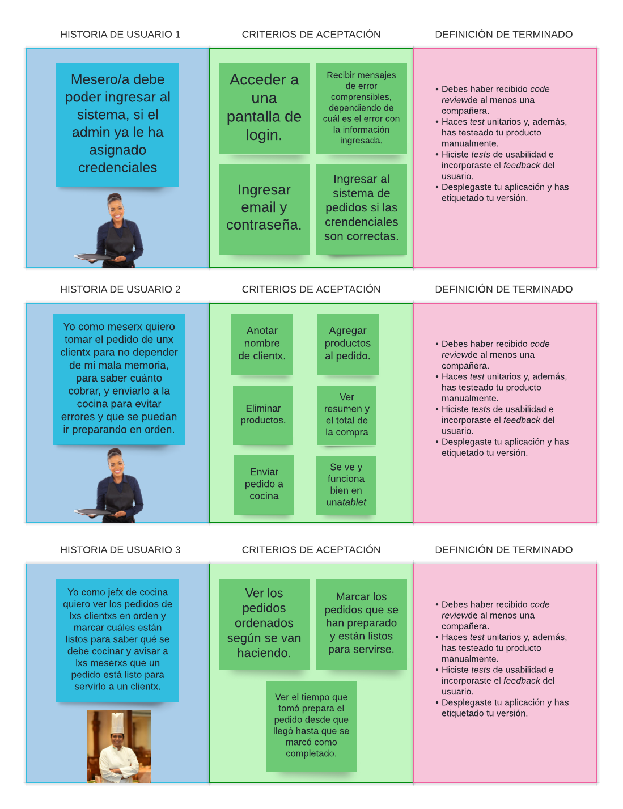
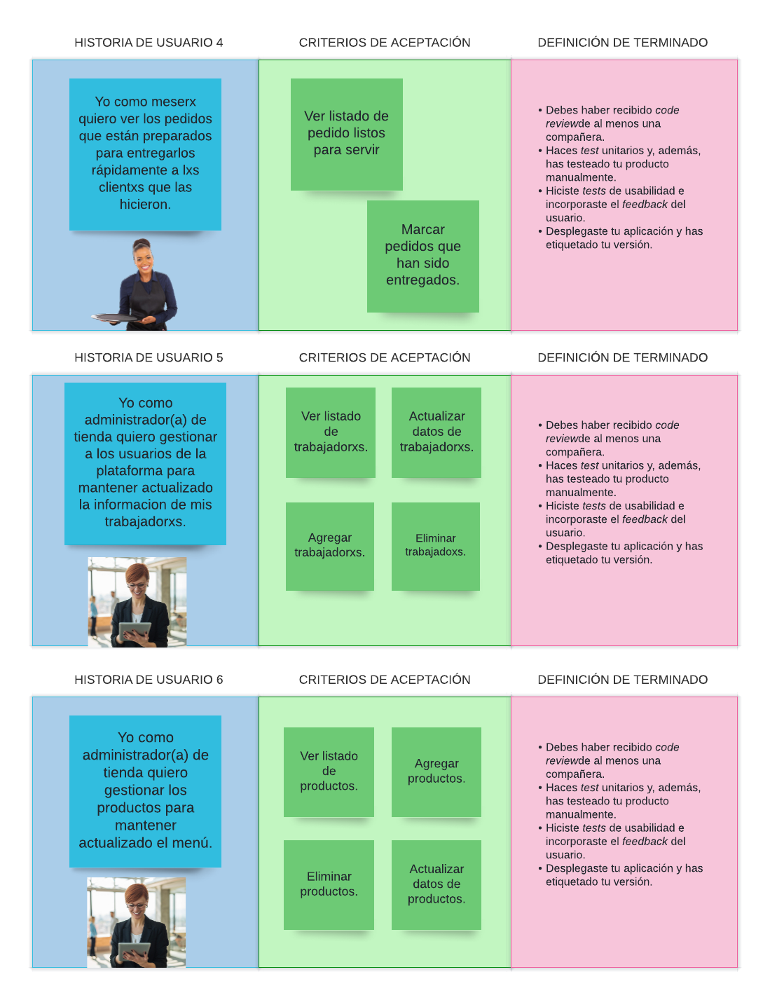

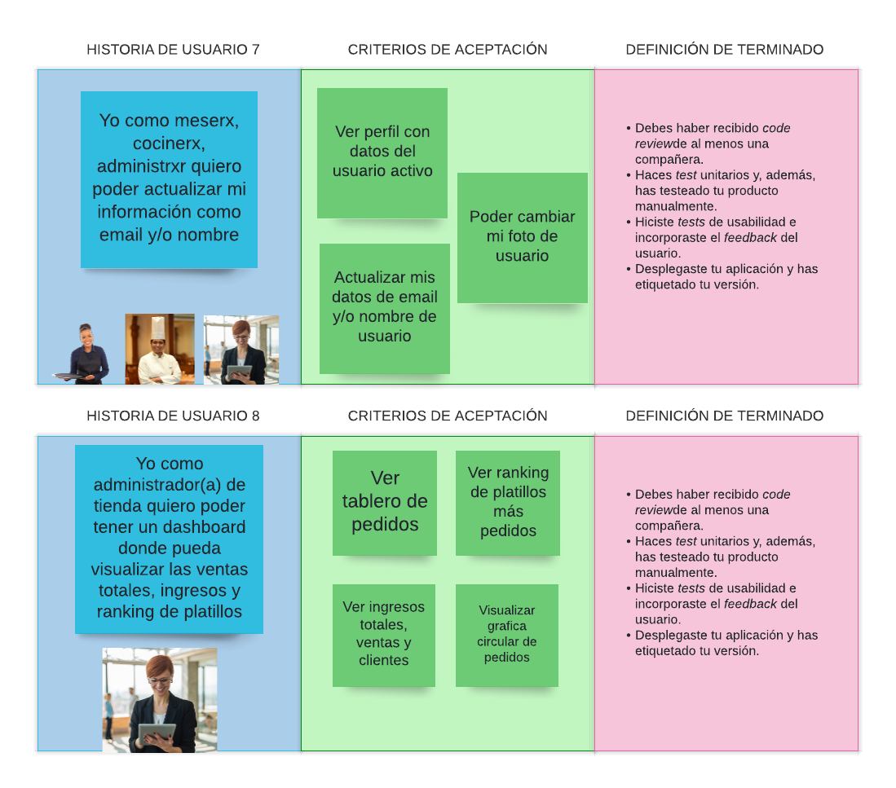

***

# 3. Diseño de la interfaz

## 3.1 Prototipo de alta fidelidad

El diseño se realizo utilizando Figma

## 📌 Diseño web y de tablet

 

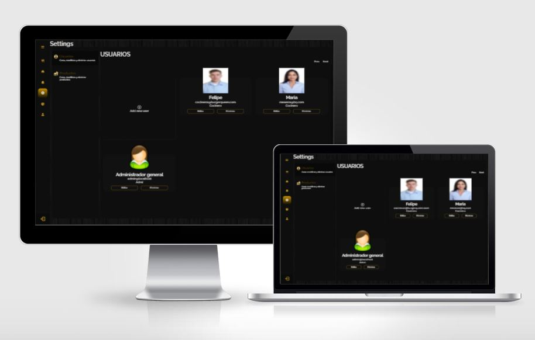

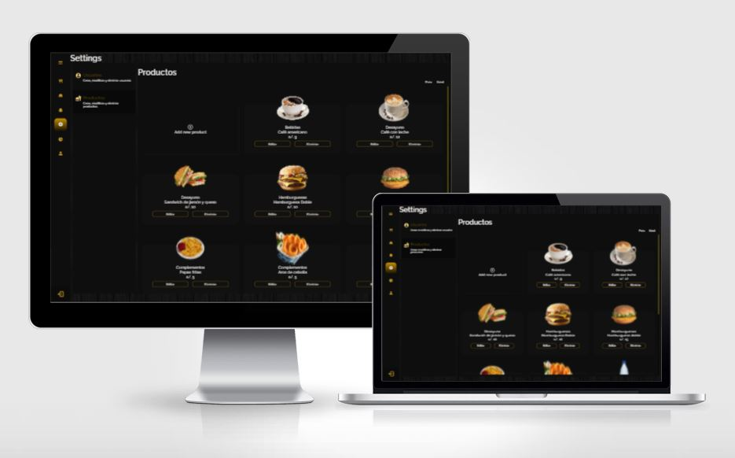

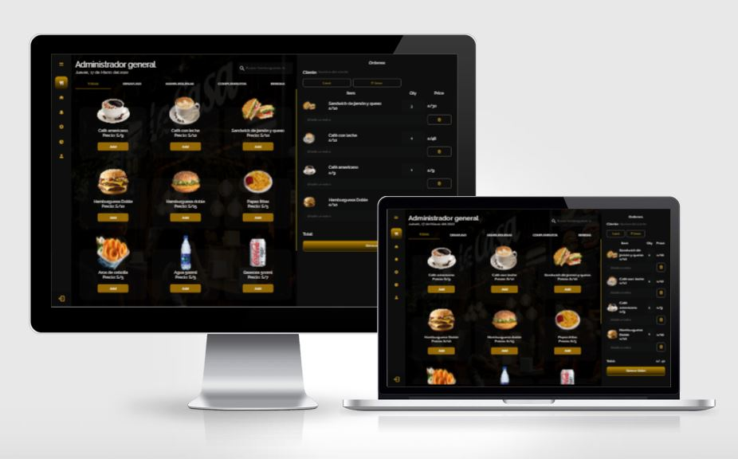

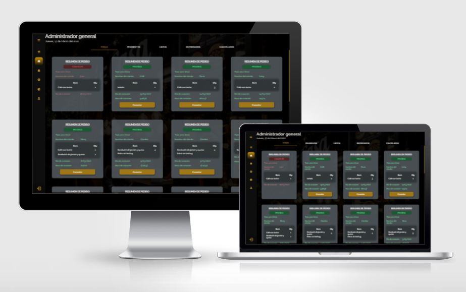

***

## 3.2 Interfaz terminada

|  Página de inicio  | 
|--|

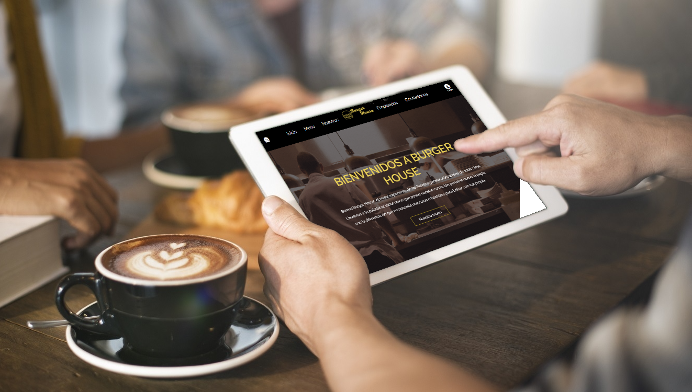

|  Inicio de sesión | 
|--|

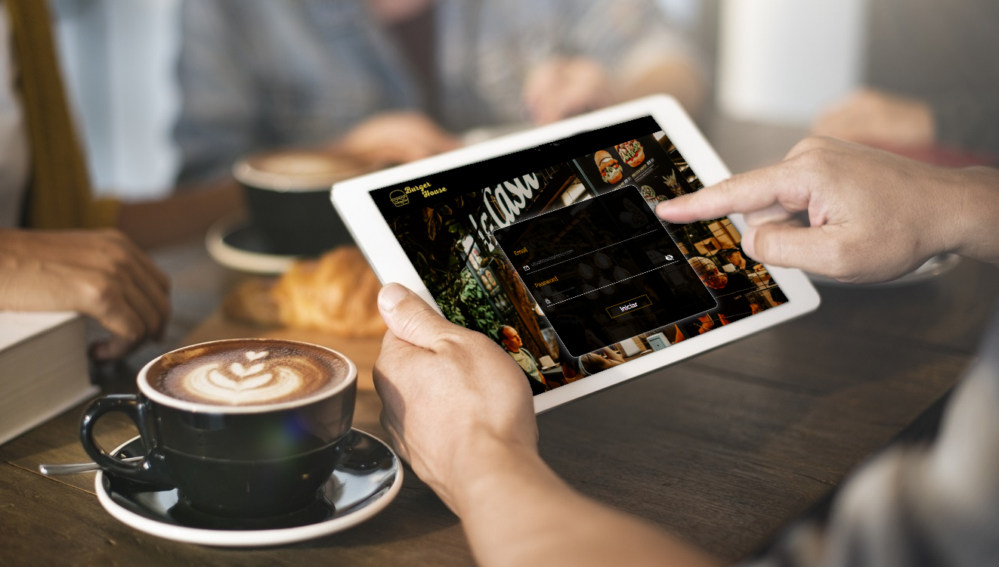

|  Administrador  | 
|--|

Usuarios

Productos
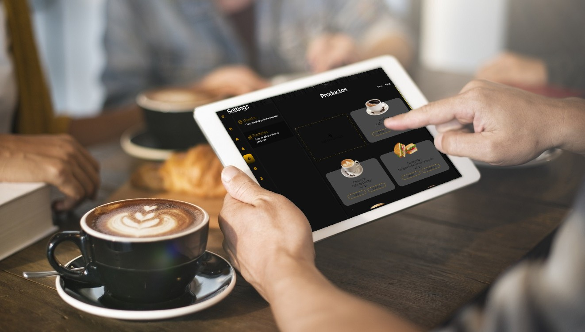

Dashboard

|  Mesero | 
|--|

Nueva Orden
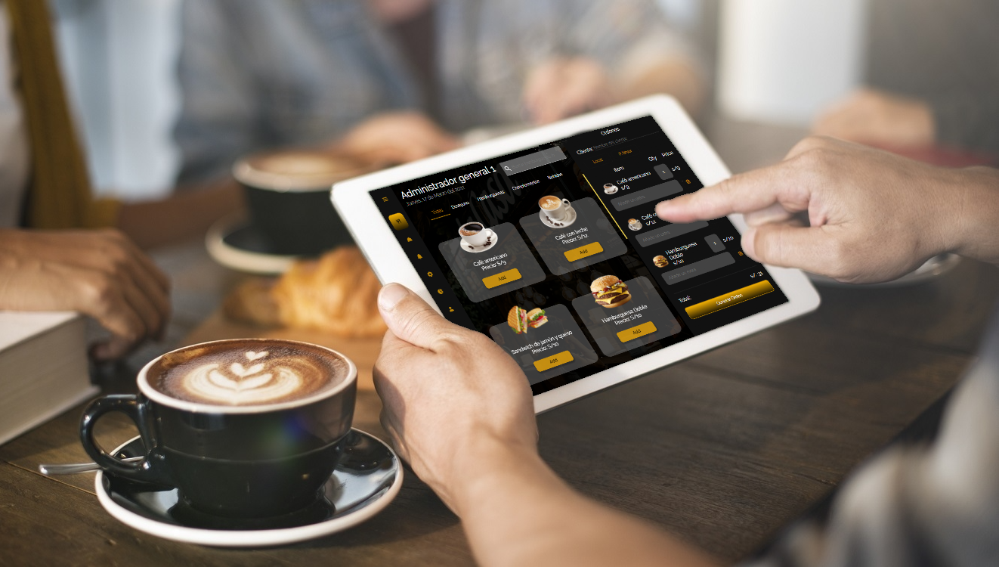

Ordenes
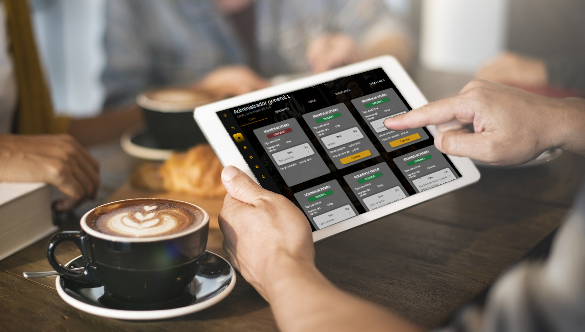

|  Cocinero | 
|--|

Ordenes Chef
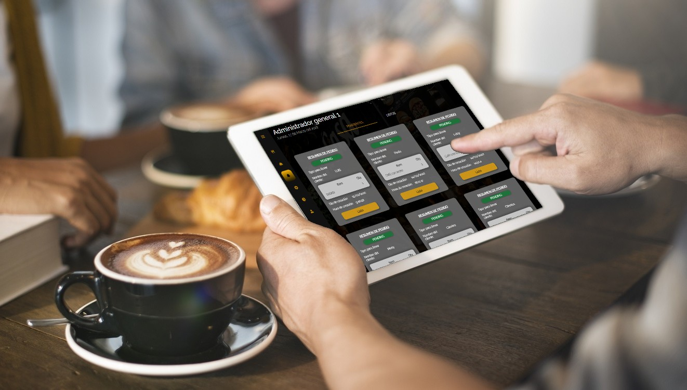

|  Perfil | 
|--|

Información
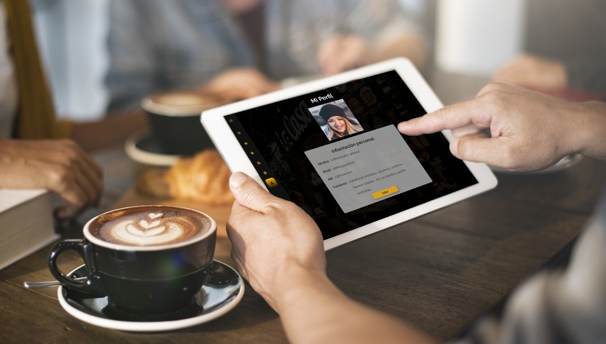

Editar Información

## 4. Test
Se realizaron los test utilizando React Testing Library.

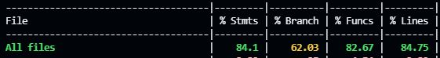

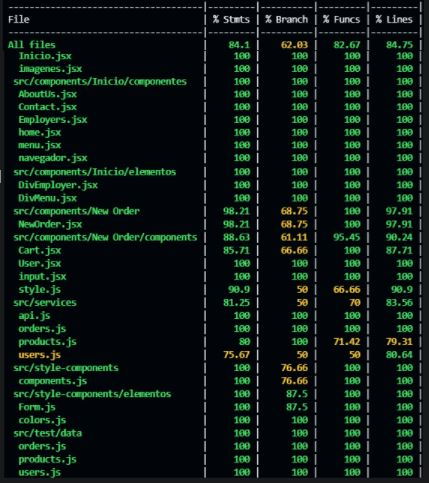

***
## 5. PWA
La web es una aplicación web progresiva (PWA).

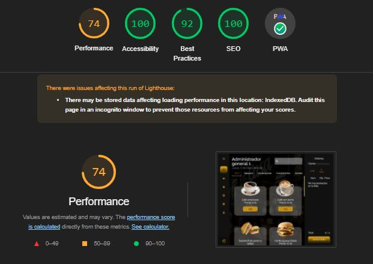

***
## 6. Fuente 📄

Burger Queen API Client del [Repositorio de Laboratoria](https://github.com/Laboratoria/LIM016-burger-queen-api-client)
***

## 7. Autores

- [Nicol Mendoza](https://github.com/nicolmendoza) 
- [Merly Anco](https://github.com/MerlyAnco) 
